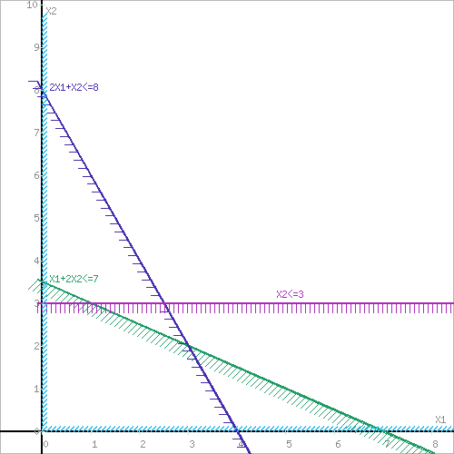
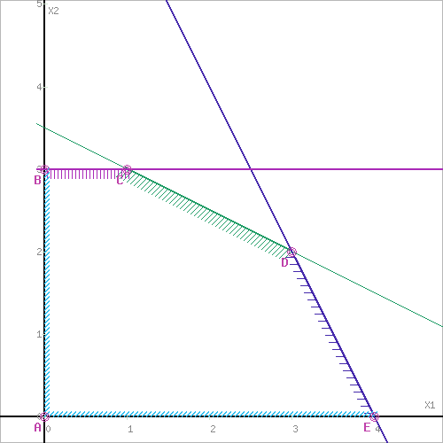
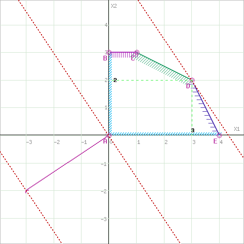

# Лаборатоная работа #3

1. Общая — могут быть неравенства, а в канонической только равенства
2. Методы естественного базиса - случай, когда подходит точка (0, 0, ..., 0) и мы берем ее в качестве исходного допустимого базисного решения. Метод искусственного базиса - вводим искусственные переменные (y_1, ..., y_n), решаем вспомогательную задачу оптимизации функции -y_1 - ... -y_n при ограничении Ax + y = b. Полученное решение является допустимым решением оригинальной задачи
3. Каждое ограничение в нашей системе образует полуплоскость, пересечение полуплоскостей — выпуклое множество
4. $\begin{cases}x_1 + x_2 \leqslant 0 \\ x_1, x_2 \geqslant 0\end{cases}$
5.  

    

    

    $x1 = 3, x2 = 2$

    $F(x) = -3*3 - 2*2 = -13$

6. $x' = x_1 + x_3$
$x'' = x_2 + x_4$
$\begin{cases}x' + x'' = 1 \\ x' - x'' = 1\end{cases} \implies \begin{cases}x' = 1 \\ x'' = 1\end{cases} \implies \begin{cases}x_1 + x_3 = 1 \\ x_2 + x_4 = 0\end{cases}$
Байес имеет вид, $a, 0, b, 0$, где $a + b = 1$ и $a \geqslant 0$, $b \geqslant 0$
7. Так как $\vec x = (1, 2, 0)$ считается допустимым базисным решением, то $x_1$ и $x_2$ входят в
базис, а $x_3$ нет, тогда $\begin{cases} x_1 = 1 - x_3 \\ x_2 = 2 - x_3 \end{cases}$
8. Мы решили, см. код
